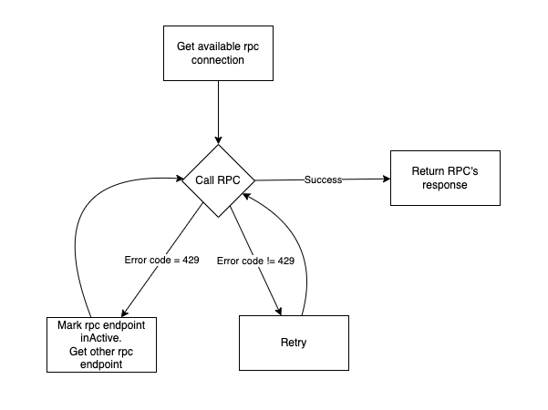

# RPC Pool Service




The RPC Pool Service is a robust replacement for the `rpc-utils.ts` file that provides multiple RPC providers with automatic failover, load balancing, and health checking capabilities.

## Features

- **Multiple RPC Providers**: Support for multiple RPC endpoints with automatic failover
- **Health Checking**: Automatic health checks to detect and reactivate failed providers
- **Load Balancing**: Round-robin distribution across active providers
- **Retry Logic**: Exponential backoff retry mechanism for failed requests
- **Error Tracking**: Track error counts and automatically deactivate problematic providers
- **NestJS Integration**: Full NestJS service integration with dependency injection
- **Monitoring**: Pool status monitoring and manual provider reactivation

## Quick Start

### Basic Usage

```typescript
import { RpcPoolService, RpcPoolConfig } from './shared/rpc-pool.service';
import { ethers } from 'ethers';

const config: RpcPoolConfig = {
  providers: [
    {
      id: 'infura-mainnet',
      provider: new ethers.JsonRpcProvider('https://mainnet.infura.io/v3/YOUR_KEY'),
      url: 'https://mainnet.infura.io/v3/YOUR_KEY',
      weight: 2,
      maxErrors: 5,
    },
    {
      id: 'alchemy-mainnet',
      provider: new ethers.JsonRpcProvider('https://eth-mainnet.alchemyapi.io/v2/YOUR_KEY'),
      url: 'https://eth-mainnet.alchemyapi.io/v2/YOUR_KEY',
      weight: 1,
      maxErrors: 3,
    },
  ],
  retryConfig: {
    maxRetries: 10,
    baseDelay: 500,
    maxDelay: 30000,
    backoffMultiplier: 2,
  },
  healthCheckInterval: 30000,
};

const rpcPool = new RpcPoolService(config);

// Use the pool
const blockNumber = await rpcPool.getBlockNumber();
const logs = await rpcPool.getLogs(filter);
const block = await rpcPool.getBlock(blockNumber);
```

### NestJS Integration

```typescript
// app.module.ts
import { Module } from '@nestjs/common';
import { RpcPoolModule } from './shared/rpc-pool.module';

@Module({
  imports: [
    RpcPoolModule.forRoot(rpcPoolConfig),
  ],
  // ... other module configuration
})
export class AppModule {}

// your.service.ts
import { Injectable } from '@nestjs/common';
import { RpcPoolService } from './shared/rpc-pool.service';

@Injectable()
export class YourService {
  constructor(private readonly rpcPool: RpcPoolService) {}

  async getBlockNumber(): Promise<number> {
    return await this.rpcPool.getBlockNumber();
  }
}
```

## Configuration

### RpcPoolConfig

```typescript
interface RpcPoolConfig {
  providers: Array<{
    id: string;           // Unique identifier for the provider
    provider: any;        // Ethers provider instance
    url: string;          // RPC endpoint URL
    weight?: number;      // Load balancing weight (default: 1)
    maxErrors?: number;   // Max errors before deactivation (default: 5)
  }>;
  retryConfig?: RpcRetryConfig;
  healthCheckInterval?: number;  // Health check interval in ms (default: 30000)
  errorThreshold?: number;       // Default error threshold (default: 5)
}
```

### RpcRetryConfig

```typescript
interface RpcRetryConfig {
  maxRetries?: number;        // Maximum retry attempts (default: 10)
  baseDelay?: number;         // Base delay in ms (default: 500)
  maxDelay?: number;          // Maximum delay in ms (default: 30000)
  backoffMultiplier?: number; // Exponential backoff multiplier (default: 2)
}
```

## API Reference

### Core Methods

- `getBlockNumber(config?)`: Get current block number
- `getLogs(filter, config?)`: Get logs with filter
- `getBlock(blockHashOrBlockTag, config?)`: Get block by hash or number
- `contractCall(contract, method, args, config?)`: Make contract call
- `executeWithRetry(rpcFunction, config?)`: Execute custom RPC function with retry

### Management Methods

- `getPoolStatus()`: Get current pool status and provider health
- `reactivateProvider(providerId)`: Manually reactivate a provider
- `stopHealthCheck()`: Stop automatic health checking
- `onModuleDestroy()`: Cleanup resources

## Migration from rpc-utils.ts

### Before (rpc-utils.ts)
```typescript
import { getBlockNumberWithRetry, getLogsWithRetry } from './shared/rpc-utils';

const blockNumber = await getBlockNumberWithRetry(provider);
const logs = await getLogsWithRetry(provider, filter);
```

### After (RpcPoolService)
```typescript
import { RpcPoolService } from './shared/rpc-pool.service';

const rpcPool = new RpcPoolService(config);
const blockNumber = await rpcPool.getBlockNumber();
const logs = await rpcPool.getLogs(filter);
```

## Benefits

1. **High Availability**: Automatic failover between multiple providers
2. **Better Performance**: Load balancing reduces single provider load
3. **Reliability**: Health checks ensure only working providers are used
4. **Monitoring**: Built-in status monitoring and error tracking
5. **Flexibility**: Easy to add/remove providers without code changes
6. **NestJS Native**: Full integration with NestJS dependency injection

## Error Handling

The service automatically handles:
- Network errors
- Rate limiting (429 errors)
- Timeout errors
- Connection failures
- Provider-specific errors

Failed providers are automatically deactivated and reactivated when they become healthy again.

## Health Checking

Health checks run automatically every 30 seconds (configurable) and:
- Test each provider with a `getBlockNumber()` call
- Reactivate providers that have recovered
- Log health check failures for monitoring

## Examples

See `rpc-pool-example.ts` for complete usage examples including:
- Basic configuration
- NestJS integration
- Contract interactions
- Pool monitoring
- Error handling 